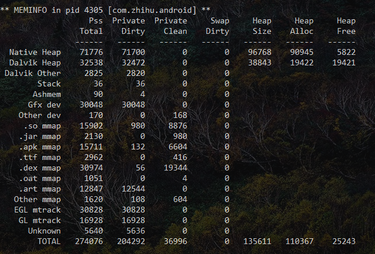
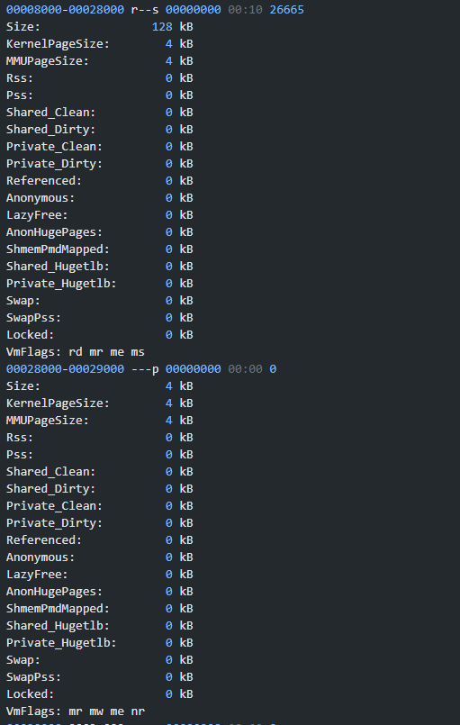
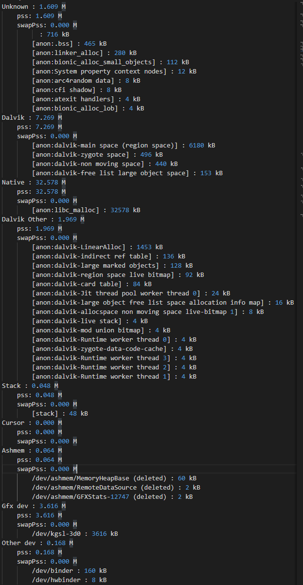
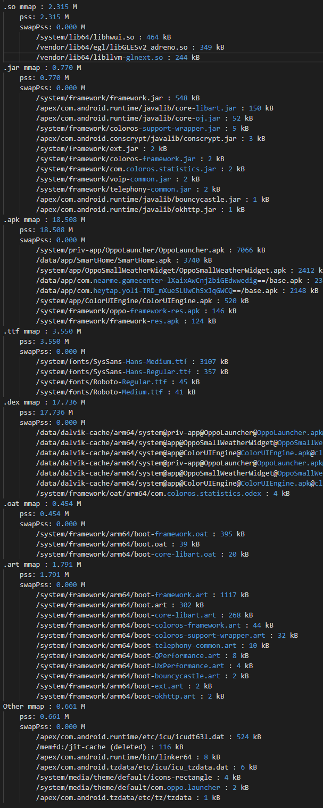

# Android-App-Memory-Analysis

单纯使用 Meminfo 的数据，可以看到是哪部分比较大，但是没有具体的信息也不好分析，而 smaps 中则有比较详细的数据，此脚本就是结合 smaps 和 meminfo

# 脚本使用

## 知道 pid 直接解析(推荐)
注意 ：需要手机有 Root 权限

```
python smaps_parser.py -p 21936 -o out.txt 
```


## 如果有现成的 smaps 文件
注意 ：获取 smaps 文件需要手机有 Root 权限

1. 获取对应进程的 smaps 文件
```
adb pull /proc/pid_of_app/smaps . 

```

2. 执行解析脚本
```
python /smap/smaps_parser.py -f <path_of_smaps>
```


## 直接

# 对比

## Meminfo 数据

Meminfo 可以看到的数据



## Smap 数据

Smaps 包含的数据



## 脚本解析后的视图





# Sample
sample 文件夹里面包含了 Launcer 的数据，感兴趣的可以自己看一下
1. smaps 文件
2. meminfo 数据
3. showmaps 数据
4. smaps 经过解析后的文件